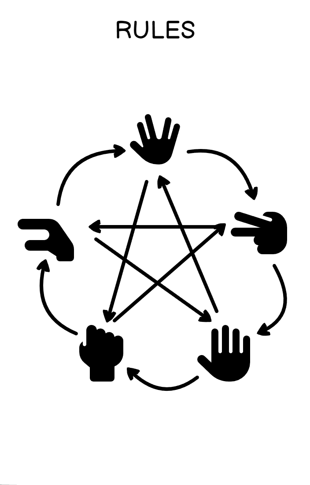

# Rock-Paper-Scissors-Lizard-Spock
Welcome to our Rock-Paper-Scissors-Lizard-Spock game!

## Overview 
This game is for anyone who is looking for a quick, easy and fun way to kill time, be it on the commute to work or wherever you have some time to kill. It is easy and intuitive for any user of any age, inspired by the hit series 'The Big Bang Theory'. For reference, lizard and spock is added to the common rock-paper-scissor game to reduce the chances of a 'draw'. 

## Features 
### Message Centre
This is where the feedback is given to the user on the outcome of each round, it tells the user if they have won, what they picked and what the computer picked

### Score Tracker
This feature keeps track of your score, tracking 'wins', 'losses' and 'draws'.

### Rules
This feature shows the game rules in a simple diagram to explain simply the logic behind the game.

## Tech Stack:
1. Balsamiq for wireframing
2. Github Projects for project management
3. HTML 5
4. CSS 3
5. Javascript
6. Miro
7. Bootstrap v4.6 (No longer using)

## Wireframes

Game Rules made using Font Awesome Icons

Starting page when visiting on a mobile device

Starting page when visiting on a larger screen device

Game layout on a mobile device

Game Layout on a larger screen device

## Project Management

We created issues on Github for user stories and added the to Github Projects for the kanban board feature, so that we could have an overview of the project and delegate tasks in an agile way. 

### User Stories
* As a user, I want to play the game wherever I want so that I can have fun whenever 
* As a site user, I want to know what my score is so I can tell if I am winning
* As a user, I want to know the rules of the game so that I know how to win
* As a user, I want a personalised experience (extra feature in future iterations)

* As a site owner, I want users to have an enjoyable experience
* As a site owner, I want to monetize traffic by showing relevant ads to users (future)

## Testing

## Issues and solutions
Scores still buggy, would apporoach code in a more linear fashion next time. Throttling function has helped stop extra scores, but makes scores arrive late sometimes.

## Acknowledgements
Webdesignerdepot for creating a modal without the use of bootstrap, just pure HTML and CSS. Reference link: https://www.webdesignerdepot.com/2012/10/creating-a-modal-window-with-html5-and-css3/  
Font Awesome for the icons used in this project.
Thanks to, Coffee, Midnight Oil and Refusal to Give Up!

## Credits
- Google and Stack Overflow for research and problem solving
- Chat GPT for code checking and solution suggestions
- Function Throttling function from- https://codedamn.com/news/javascript/throttling-in-javascript

